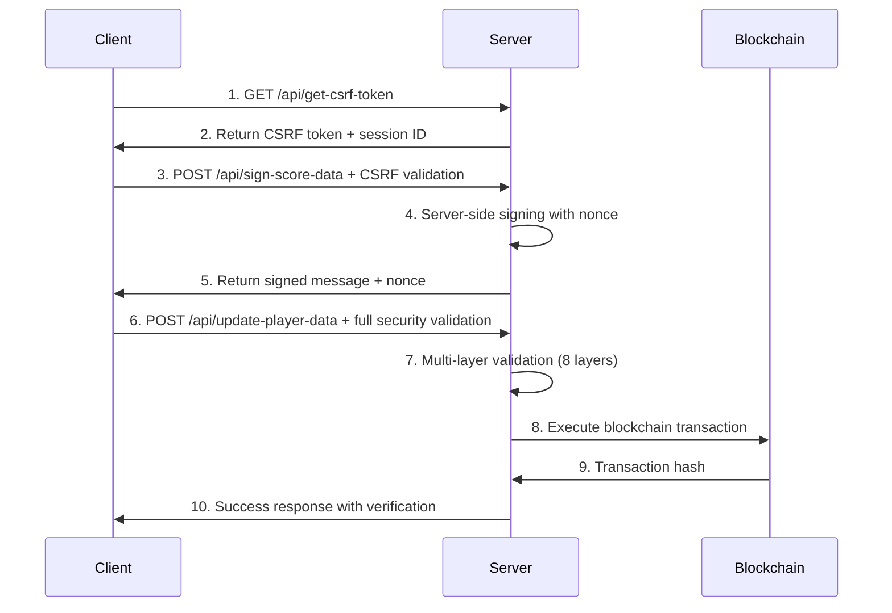

# 🔐 Enhanced Security Architecture Documentation

## Overview
This system implements a **multi-layered security architecture** designed to prevent replay attacks, CSRF attacks, and unauthorized score submissions. All cryptographic operations are performed server-side using enterprise-grade security patterns.

## 🛡️ Security Layers

### Layer 1: Origin Validation
- **Strict origin checking** against allowlist
- **User-Agent filtering** to block automated tools
- **Referer header validation** as secondary check

### Layer 2: Rate Limiting
- **Per-IP rate limiting** with configurable windows
- **Endpoint-specific limits** (CSRF: 20/min, Updates: 5/min, Signatures: 20/min)
- **Exponential backoff** for failed requests

### Layer 3: CSRF Protection
- **Cryptographically secure tokens** with HMAC-SHA256
- **One-time use enforcement** with server-side tracking
- **Short expiration windows** (5 minutes max)
- **Session binding** for additional security

### Layer 4: Server-Side Cryptography
- **100% server-side message signing** using game server wallet
- **Cryptographically secure nonces** (32-byte entropy)
- **Message structure validation** with strict format checking
- **Timestamp-based expiration** (2 minutes max age)

### Layer 5: Nonce-Based Deduplication
- **Unique nonce per request** preventing replay attacks
- **Server-side nonce tracking** with automatic cleanup
- **Hash-based request fingerprinting** for additional protection

### Layer 6: Input Validation & Sanitization
- **Strict type checking** for all parameters
- **Range validation** with configurable limits
- **Address format validation** using blockchain standards
- **Score-to-transaction ratio limits** preventing unrealistic submissions

### Layer 7: Enhanced Error Handling
- **Detailed error classification** for different attack vectors
- **Secure error responses** without information leakage
- **Comprehensive logging** for security monitoring

### Layer 8: Response Security
- **Server signature verification** on all responses
- **Secure headers** (HSTS, X-Frame-Options, CSP-ready)
- **Timestamp inclusion** for freshness validation

## 🔄 Secure Request Flow



## 🚨 Security Features

### Replay Attack Prevention
- **Unique nonces** for every request
- **Server-side nonce tracking** with collision detection
- **Time-bounded signatures** (2-minute max age)
- **One-time CSRF token usage**

### CSRF Attack Prevention
- **Double-submit cookie pattern** implementation
- **HMAC-signed tokens** with server secret
- **Origin header verification**
- **SameSite cookie attributes** (when applicable)

### Man-in-the-Middle Protection
- **HTTPS enforcement** in production
- **HSTS headers** for transport security
- **Message integrity** via HMAC signatures

### Injection Attack Prevention
- **Strict input validation** with type checking
- **Parameterized blockchain calls** (no string concatenation)
- **Output encoding** for all responses

### Brute Force Protection
- **Rate limiting** across multiple dimensions
- **Exponential backoff** on failures
- **IP-based blocking** for suspicious activity

## 📊 Security Monitoring

### Metrics to Monitor
- **Request rates** per IP and endpoint
- **CSRF token usage patterns**
- **Failed validation attempts**
- **Nonce collision attempts**
- **Unusual score patterns**

### Alert Triggers
- **Rate limit violations**
- **Multiple CSRF failures from same IP**
- **Suspicious score-to-transaction ratios**
- **Repeated nonce reuse attempts**

## 🔧 Configuration

### Environment Variables
```bash
# Cryptographic secrets (rotate monthly)
API_SECRET="64-char-minimum-secure-random-string"
CSRF_SECRET="64-char-minimum-secure-random-string"

# Blockchain configuration
WALLET_PRIVATE_KEY="game-server-wallet-private-key"

# Multiple RPC endpoints for redundancy
ALCHEMY_RPC_URL="primary-rpc-endpoint"
ALCHEMY_RPC_URL_2="backup-rpc-endpoint-2"
# ... up to 5 endpoints
```

### Security Limits (Configurable)
```typescript
const SECURITY_LIMITS = {
  MAX_SCORE_PER_REQUEST: 1000,
  MAX_TRANSACTIONS_PER_REQUEST: 5,
  MAX_SCORE_PER_TRANSACTION: 500,
  CSRF_TOKEN_LIFETIME: 5 * 60 * 1000, // 5 minutes
  SIGNATURE_MAX_AGE: 2 * 60 * 1000,   // 2 minutes
  NONCE_CLEANUP_INTERVAL: 10 * 60 * 1000, // 10 minutes
};
```

## 🧪 Security Testing

### Recommended Tests
1. **CSRF Token Validation**
   - Test token reuse prevention
   - Test expired token rejection
   - Test invalid token format handling

2. **Nonce Replay Testing**
   - Test duplicate nonce rejection
   - Test nonce collision handling
   - Test expired signature rejection

3. **Rate Limiting Validation**
   - Test per-IP limits
   - Test endpoint-specific limits
   - Test reset behavior

4. **Input Validation Testing**
   - Test malformed addresses
   - Test excessive score amounts
   - Test negative values
   - Test type confusion attacks

5. **Origin Validation Testing**
   - Test cross-origin requests
   - Test spoofed origin headers
   - Test missing origin headers

## 🔒 Best Practices

### For Developers
1. **Never log sensitive data** (private keys, tokens, nonces)
2. **Rotate secrets regularly** (monthly minimum)
3. **Monitor security metrics** continuously
4. **Keep dependencies updated** for security patches
5. **Use parameterized queries** for all database operations

### For Operations
1. **Set up security monitoring** with automated alerts
2. **Regular security audits** of environment variables
3. **Backup and test recovery procedures**
4. **Monitor blockchain transaction patterns**
5. **Implement fail-safe mechanisms** for high-risk operations

## 🚀 Production Deployment Checklist

- [ ] All environment variables set with secure values
- [ ] HTTPS enforced with valid certificates
- [ ] Rate limiting configured and tested
- [ ] Security headers implemented
- [ ] Error handling tested for information leakage
- [ ] Monitoring and alerting configured
- [ ] Backup RPC endpoints configured and tested
- [ ] Game server wallet has correct permissions
- [ ] CSRF token generation and validation tested
- [ ] Nonce deduplication tested under load

## 📞 Security Incident Response

1. **Immediate Actions**
   - Rotate compromised secrets immediately
   - Block suspicious IP addresses
   - Scale down affected services if needed

2. **Investigation**
   - Analyze logs for attack patterns
   - Check blockchain transactions for anomalies
   - Verify data integrity

3. **Recovery**
   - Deploy security patches
   - Update configuration as needed
   - Resume normal operations gradually

4. **Post-Incident**
   - Document lessons learned
   - Update security procedures
   - Enhance monitoring based on attack vectors

---

**Remember**: Security is an ongoing process, not a one-time implementation. Regular audits, updates, and monitoring are essential for maintaining a secure system.